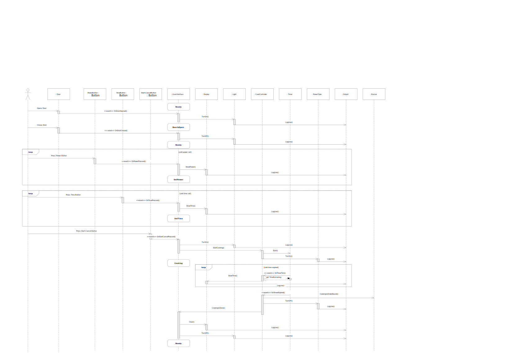
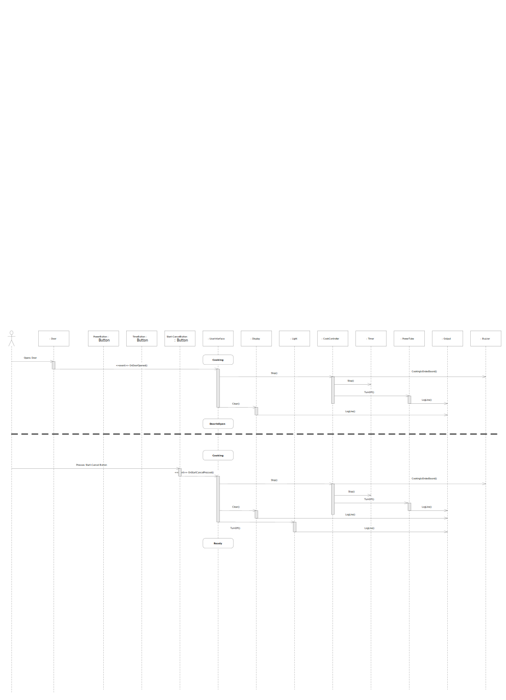
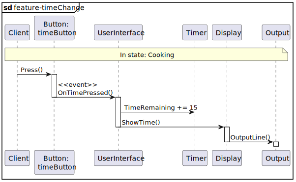

<!--
Journalen skal indeholde
x Your team number
x A table containing the student number and name of each participant in the exercise.
x Direct URLs for all the Jenkins build jobs executing your tests for each new feature, and the Jenkins job for the main branch, eg. http://ci3.ase.au.dk:8080/job/SWTE22_xx_MW_Feature1
x A URL to the GitHub repository, you are using as the shared remote repository for your team, e.g. http://github.com/TeamSWTxxx/MicrowaveHandin3/
o A new class diagram describing the final testable design after you have added all features
o Relevant new sequence diagrams describing each new feature
o A new STM diagram for the UserInterface class, describing the final result after you have added all features
o Any new STM diagrams, if you have chosen to use an STM in other classes to implement the new features
o A short description of what has been changed and what has been added (you don’t have to explain why). Explain and refer to the diagrams where relevant
o A short description of your decisions for the individual features where you had a choice
o If you have made personal features, a full specification of those
-->

<!-- omit in toc -->
# SWT Handin 3 - Microwave Oven

<!-- omit in toc -->
## Group 4 handin information
|   | Name                         | Student Number |
|---|------------------------------|----------------|
| 1 | Atren Amanoel Darvesh        | 201405993      |
| 2 | Simon Hjortgaard Bos         | 201910459      |
| 3 | Mathias Birk Olsen           | 202008722      |
| 4 | Oliver Vestergaard Schousboe | 202008211      |

<!-- omit in toc -->
## Table of contents
- [Git Structure](#git-structure)
- [Git branches](#git-branches)
- [Jenkins jobs](#jenkins-jobs)

## Git

[GitHub link](https://github.com/bedstitest/handin03_MicrowaveOven)

### Git Structure

We have decided to use `Feature branching` for our git workflow.

### Git branches

There are a total of 4 branches. The different brances are:

1. main
2. feature/buzzer
3. feature/powerChange
4. feature/timeChange

## Jenkins jobs

There are a total of 4 jobs - one for each branch. Links to the different jobs:

1. [team04E22-microwave-main](http://ci3.ase.au.dk:8080/job/team04E22-microwave-main/)
2. [team04E22-microwave-feature-buzzer](http://ci3.ase.au.dk:8080/job/team04E22-microwave-feature-buzzer/)
3. [team04E22-microwave-feature-powerChange](http://ci3.ase.au.dk:8080/job/team04E22-microwave-feature-powerCharge/)
4. [team04E22-microwave-feature-timeChange](http://ci3.ase.au.dk:8080/job/team04E22-microwave-feature-timeChange/)

## Class diagram

It was decided to use the existing class diagram as a base and only add any changes we made to it.

### Buzzer

## Sequence diagrams

### Buzzer

### Power change

<!--ADD FEATURE SEQUENCE DIAGRAM-->

### Time change

## Updated state machine diagram

It was decided to copy the diagram from the handout and extend it with the new features. Additions are colored blue.

<!--ADD STATE MACHINE DIAGRAM FOR USER INTERFACE-->

<!--### Other STM's if relevant-->

## Description of changes and additions

<!--Ony what, not why.
Explain and reference to diagrams where relevant-->

### Buzzer

There has been implemented a buzzer class that has the responsibility of making a 3 burst sound whenever Cooking is done.
This is obtained by making an interface and a class that implements this interface which has 1 function "CookingIsEndedSound()".
CookingController.cs and UserInterface.cs have been altered so as it also takes a buzzer object in its constructor parameter.
The function CookingIsEndedSound() is then inserted in CookController.OnTimerExpired(), CookController.Stop() and UserInterface.CookingIsDone().

In the tests the test.integration project was unloaded so to avoid testings conflicts.
The BuzzerTest.cs tests the simple functionality of the buzzer class. It creates a Trace object which can catch console outputs when running the tests. This output is then asserted with the expected string value "Ding, Ding, Ding! Cooking Done\a".

There has also been written a functional test in the CookingControllerTest.cs. Cooking_stopsound_CookingDone() tests if the CookingIsEndedSound() through the uut (CookController.StartCooking() function). 

### Power change

### Time change

The only things added to the code are 
- `UserInterface` has a reference to the `Timer` to make it possible to add time while cooking.
- In the `UserInterface` state machine (switch case), the logic for adding time while in state `cooking` was addded. 
- The `Timer` classes property TimeRemaining was changed to have a public setter instead of the private in the original.

## Decisions

